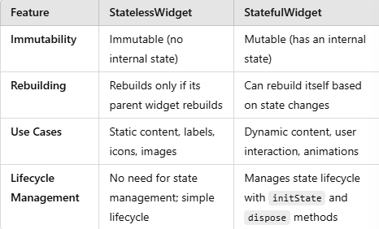
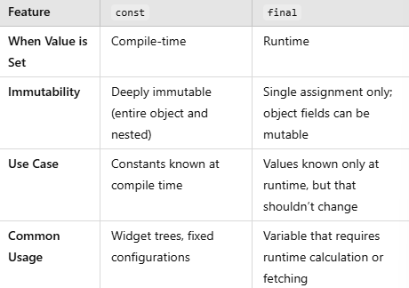

**ASSIGNMENT 7**

1. Explain what are stateless widgets and stateful widgets, and explain the difference between them.

Stateless Widgets : A StatelessWidget is a widget that does not change once it’s built. This type of widget is immutable, meaning its properties and appearance are fixed throughout its lifetime.

Statefull Widgets : A StatefulWidget is a widget that can rebuild itself based on changes in its state. These widgets are mutable, and they can update their appearance in response to user interaction or other events.

Here are some difference between them



2. Mention the widgets that you have used for this project and its uses.
- MaterialApp: The root widget for the app that provides theme settings and navigation structure. It applies the ThemeData for consistent design across the app.

- Scaffold: This widget provides the primary structure for each screen, including the app bar, body, and any floating buttons. In this case, it's used to build the structure of MyHomePage.

- AppBar: A toolbar typically displayed at the top of the screen. Here, it displays the app title, "Mental Health Tracker," with specific styling.

- Padding: Adds padding around its child widget. In this project, it’s used to add spacing around the main body of the Scaffold to improve layout aesthetics.

- Column: A layout widget that arranges its children vertically. It’s used in various places to vertically align widgets, such as the rows of InfoCard widgets and the "Welcome to Dam-Shop!" message with the item grid.

- Row: A layout widget that arranges its children horizontally. It’s used to display three InfoCard widgets side by side.

- SizedBox: Used to add vertical space between widgets (16.0 units in this case) for a cleaner layout.

- Center: Centers its child widget within itself, ensuring items are aligned centrally on the screen.

- GridView.count: Creates a grid layout with a specific number of columns. It’s used to display the ItemCard widgets in a three-column grid, making it ideal for presenting a list of options or items in a compact, organized way.

- Card: Displays information within a container that has elevation and rounded corners, providing a card-like appearance. InfoCard uses it to show details like "View," "Add," and "Logout."

- Container: A versatile widget that allows adding padding, margins, color, width, height, etc., to its child. It’s used within InfoCard to set padding and width and in ItemCard to add padding and customize the layout.

- Text: Displays a string of text. It’s used throughout the app for titles, messages, and button labels, with specific styling applied for font size, weight, and color.

- Icon: Displays an icon from the Flutter Icons library. Each ItemCard displays a unique icon for each item (e.g., Icons.visibility for viewing products).

- Material: Provides a visual styling background for widgets. In ItemCard, it’s used to set a background color with rounded corners and theme-based styling.

- InkWell: A touchable widget that provides a ripple effect when tapped. ItemCard uses this to create a tap response that shows a SnackBar message.

- SnackBar: Displays a temporary message at the bottom of the screen. In this project, it’s shown when an ItemCard is tapped, providing feedback with a message indicating which button was pressed.

- MediaQuery: Provides information about the device screen dimensions and density. In InfoCard, it’s used to calculate the card’s width relative to the screen size.

3. What is the use-case for setState()? Explain the variable that can be affected by setState().

Use-case for setState()
- Updating UI in Response to User Interaction: When a button is pressed, or a form field changes, setState() allows the UI to reflect these changes. For example, updating a counter when a user presses an increment button.
- Dynamic Data Display: When data changes dynamically, such as fetching data from an API or changing a display based on user input, setState() triggers a rebuild to reflect the updated data.
- Animation or Progress Changes: You can use setState() to update the progress of an animation, or show/hide elements based on animation state or user interaction.

Variable that can be affected by setState().
- Counter Variables: A variable that tracks the number of times a button has been pressed. For example:
```dart
int counter = 0;
void incrementCounter() {
  setState(() {
    counter++;
  });
}
```
- Boolean Flags: Flags that control visibility or enable/disable certain elements. For example:
```dart
bool isLoading = false;
void toggleLoading() {
  setState(() {
    isLoading = !isLoading;
  });
}
```
- List or Collection Variables: Lists that store data for display, such as a list of items in a shopping cart. For example:
```dart
List<String> items = [];
void addItem(String item) {
  setState(() {
    items.add(item);
  });
}
```
- Text or String Variables: Text that changes dynamically, like a welcome message or an error message. For example:
```dart
String message = "Welcome!";
void updateMessage(String newMessage) {
  setState(() {
    message = newMessage;
  });
}
```

4. Explain the difference between const and final keyword.
The const keyword is used for compile-time constants with deeply immutable values known ahead of time, while final is for variables that are assigned once but may be initialized at runtime. const ensures the entire object and its contents are fixed, making it ideal for widgets that don’t change. In contrast, final allows setting values that may depend on runtime information but prevents reassignment after the first initialization.

Key Differences:



5. Explain how you implemented the checklist above step-by-step.    

- Run the command flutter create dam-shop to create a new Flutter app
- In main.dart, set up the MaterialApp widget with a theme that has an e-commerce style, typically with bright and inviting colors (such as blue or orange) and define the color scheme within ThemeData to apply it across the application.
- In main.dart, set the home property of MaterialApp to point to MyHomePage, Create a MyHomePage widget that will display the three buttons (View Product List, Add Product, and Logout). Define a list of button items with icons and titles in MyHomePage to dynamically create buttons.
- Create a custom widget for each button, such as ItemCard, to display both an icon and text. Use a GridView.count widget to display the buttons in a grid layout, so they appear in rows and columns. For each button, set an InkWell to capture the button press event and display a SnackBar message.
- In ItemCard, use Theme.of(context).colorScheme.secondary to style the background color. To apply a unique color to each button, add a color property to the ItemHomepage class or modify each ItemCard to switch colors based on the button type.
- Use an InkWell or GestureDetector in each ItemCard to detect button taps.Within the onTap callback, use ScaffoldMessenger.of(context).showSnackBar() to display a specific SnackBar message based on the button pressed.

**ASSIGNMENT 8**

1. What is the purpose of const in Flutter? Explain the advantages of using const in Flutter code. When should we use const, and when should it not be used?

Purpose
The const keyword is used to define values that are immutable and known at compile time. It helps Flutter identify and optimize widgets and objects so that they do not need to be rebuilt unnecessarily, leading to better performance.

Advantages
The advantages of using const in flutter is that it ensures that an object is created only once, and this single instance is reused, saving memory and since const objects cannot change after they are initialized, they make the code more predictable and reduce potential bugs related to object mutation.

When to use cons
Use const when creating widgets that do not change during the lifecycle of the app
When you use the same widget or value multiple times across your app, using const can help with caching and reduce memory usage.
Use const when you have values that are already known at compile time, such as mathematical constants (const double pi = 3.14159;) or widgets built with such values.

When should it not be used
 If the value or widget changes based on user interactions, state changes, or API responses, const should not be used. const is only applicable to values known at compile time.
 If a widget's properties are set to dynamic or runtime values, you should avoid using const, as it would not allow runtime variability.

 2. Explain and compare the usage of Column and Row in Flutter. Provide example implementations of each layout widget!

 ## Comparison of `Column` and `Row`

| Feature               | `Column`                           | `Row`                            |
|-----------------------|-------------------------------------|----------------------------------|
| Direction             | Vertical (top to bottom)            | Horizontal (left to right)       |
| Main Axis             | Vertical                            | Horizontal                       |
| Cross Axis            | Horizontal                          | Vertical                         |
| Use Case              | Stacking widgets vertically         | Arranging widgets side by side   |
| Main Axis Alignment   | Top, Center, SpaceBetween, etc.     | Start, End, Center, etc.         |
| Cross Axis Alignment  | Start, Center, Stretch, etc.        | Top, Center, Stretch, etc.       |

## Example Implementation of `Row`
```dart
import 'package:flutter/material.dart';

void main() {
  runApp(MyApp());
}

class MyApp extends StatelessWidget {
  @override
  Widget build(BuildContext context) {
    return MaterialApp(
      home: Scaffold(
        appBar: AppBar(title: Text('Row Example')),
        body: Row(
          mainAxisAlignment: MainAxisAlignment.spaceAround,
          crossAxisAlignment: CrossAxisAlignment.center,
          children: [
            Icon(Icons.home, size: 50),
            Icon(Icons.favorite, size: 50),
            Container(
              color: Colors.red,
              height: 50,
              width: 50,
              child: Center(child: Text('Box')),
            ),
            Text('End'),
          ],
        ),
      ),
    );
  }
}
```

## Example Implementation of `Column`
```dart
import 'package:flutter/material.dart';

void main() {
  runApp(MyApp());
}

class MyApp extends StatelessWidget {
  @override
  Widget build(BuildContext context) {
    return MaterialApp(
      home: Scaffold(
        appBar: AppBar(title: Text('Column Example')),
        body: Column(
          mainAxisAlignment: MainAxisAlignment.center,
          crossAxisAlignment: CrossAxisAlignment.start,
          children: [
            Text('Item 1'),
            Text('Item 2'),
            Container(
              color: Colors.blue,
              height: 50,
              width: 100,
              child: Center(child: Text('Box')),
            ),
            Icon(Icons.star, size: 40),
          ],
        ),
      ),
    );
  }
}
```

3. List the input elements you used on the form page in this assignment. Are there other Flutter input elements you didn’t use in this assignment? Explain!

### 1. Input Elements Included
- **TextFormField**
  - Used to input the **Name** of the food.
  - Used to input the **Description** of the food.
  - Used to input the **Amount** of the food (with `keyboardType` set to `TextInputType.number` for numeric input).
- **ElevatedButton**
  - Used as a button to trigger form validation and save the data.

## Other Flutter Input Elements Not Used

### 1. DropdownButtonFormField
- A form field that shows a dropdown list of items for the user to select one from. Useful for selecting categories or predefined options.

### 2. Checkbox and CheckboxListTile
- Widgets that let users toggle a boolean value. They are useful for enabling or disabling options or settings.

### 3. Radio and RadioListTile
- Used for selecting one value from a set of mutually exclusive options. Ideal for allowing users to choose from multiple options.

### 4. Switch
- A widget used to toggle a setting on or off, similar to a checkbox but presented as a sliding switch.

### 5. Slider
- Used for selecting a value from a range by sliding a thumb along a track. Useful for selecting quantities, ratings, etc.

### 6. DatePicker
- A date picker widget that allows users to select a date. Could be useful for date-related inputs, such as expiration dates.

### 7. TimePicker
- A widget for selecting a time. Ideal for forms requiring time-related data.

### 8. TextField
- Similar to `TextFormField` but does not come with built-in validation. It is a more basic input field.

## Explanation
- The **`TextFormField`** widget was used for input fields that needed validation, as it integrates well with `Form` widgets and offers built-in validation.
- **Dropdowns**, **Checkboxes**, **Radio buttons**, **Sliders**, and **Switches** are appropriate for inputs where users need to choose between predefined options, toggle values, or set ranges.
- This assignment included basic text and numeric input, so `TextFormField` was sufficient.
- **DatePicker** and **TimePicker** were not used because there was no requirement for date or time inputs.

Additional input widgets are used based on the specific needs of the form. For example, **DropdownButtonFormField** or **Checkbox** would be helpful for allowing users to choose from predefined categories or set boolean values.

4. How do you set the theme within a Flutter application to ensure consistency? Did you implement a theme in your application?

To ensure visual consistency throughout a Flutter application, it's essential to set a global theme. The theme defines the colors, fonts, and other visual properties that apply across the app, maintaining a cohesive and uniform design. This can be done using the `ThemeData` class.

### How to Set a Global Theme
1. **Define a Theme in `MaterialApp`**:
   - The theme is set by passing a `ThemeData` object to the `theme` property in the `MaterialApp` widget.

2. **Customize the `ThemeData`**:
   - The `ThemeData` class provides a range of customization options, such as primary and secondary colors, font styles, button themes, and input decoration themes.

**Example of Setting a Global Theme**:
```dart
import 'package:flutter/material.dart';

void main() {
  runApp(MyApp());
}

class MyApp extends StatelessWidget {
  @override
  Widget build(BuildContext context) {
    return MaterialApp(
      title: 'Flutter Themed App',
      theme: ThemeData(
        primaryColor: Colors.blue,
        colorScheme: ColorScheme.fromSwatch().copyWith(
          primary: Colors.blue,
          secondary: Colors.green,
        ),
        appBarTheme: AppBarTheme(
          backgroundColor: Colors.blue,
          foregroundColor: Colors.white,
        ),
        buttonTheme: ButtonThemeData(
          buttonColor: Colors.blue,
          textTheme: ButtonTextTheme.primary,
        ),
        textTheme: const TextTheme(
          bodyText1: TextStyle(color: Colors.black, fontSize: 18),
          bodyText2: TextStyle(color: Colors.grey, fontSize: 16),
        ),
      ),
      home: HomePage(),
    );
  }
}

class HomePage extends StatelessWidget {
  @override
  Widget build(BuildContext context) {
    return Scaffold(
      appBar: AppBar(
        title: const Text('Themed App'),
      ),
      body: Center(
        child: ElevatedButton(
          onPressed: () {},
          child: const Text('Click Me'),
        ),
      ),
    );
  }
}
```

5. How do you manage navigation in a multi-page Flutter application?

In a multi-page Flutter application, navigation is essential for providing users with a seamless experience. Flutter offers several ways to handle navigation between screens. Below is a comprehensive guide on managing navigation effectively.

## 1. Using the `Navigator` Class
The `Navigator` class is the core tool for handling navigation in Flutter. It maintains a stack-based history of routes (pages) and provides methods for pushing and popping routes.

### Common Navigation Methods:
- **`Navigator.push`**: Pushes a new route onto the stack.
- **`Navigator.pop`**: Pops the current route off the stack.
- **`Navigator.pushReplacement`**: Replaces the current route with a new one.
- **`Navigator.pushNamed`**: Navigates to a predefined named route.
- **`Navigator.popUntil`**: Pops routes until a specified condition is met.

### Example of Basic Navigation:
```dart
Navigator.push(
  context,
  MaterialPageRoute(builder: (context) => SecondPage()),
);
```
### Example of popping a route:
```dart
Navigator.pop(context);
```
## 2. Route Management with MaterialPageRoute
`MaterialPageRoute` is a widget that provides material design page transition animations.

### Example:
```dart
Navigator.push(
  context,
  MaterialPageRoute(builder: (context) => SecondPage()),
);
```

## 3. Named Routes for Scalability

For larger and more scalable applications, defining named routes makes navigation easier and more maintainable.

### Defining Named Routes:
```dart
void main() {
  runApp(MaterialApp(
    initialRoute: '/',
    routes: {
      '/': (context) => HomePage(),
      '/second': (context) => SecondPage(),
    },
  ));
}
```
### Navigating Using Named Routes:
```dart
Navigator.pushNamed(context, '/second');
```

## 4. Navigation with Data Passing

### Passing Data Example:
```dart
Navigator.push(
  context,
  MaterialPageRoute(
    builder: (context) => SecondPage(data: 'Hello from the first page'),
  ),
);
```
### Receiving Data Example:
```dart
class SecondPage extends StatelessWidget {
  final String data;
  const SecondPage({Key? key, required this.data}) : super(key: key);

  @override
  Widget build(BuildContext context) {
    return Scaffold(
      body: Center(
        child: Text(data),
      ),
    );
  }
}
```

## 5. Using Navigator.pushNamed with Arguments

Navigator.pushNamed allows for structured argument passing by using the arguments parameter.

### Passing Arguments:
```dart
Navigator.pushNamed(
  context,
  '/second',
  arguments: 'Hello from the first page',
);
```
### Receiving Arguments:
```dart
class SecondPage extends StatelessWidget {
  @override
  Widget build(BuildContext context) {
    final String data = ModalRoute.of(context)!.settings.arguments as String;
    return Scaffold(
      body: Center(
        child: Text(data),
      ),
    );
  }
}
```

## 6. Advanced Navigation with Packages

For complex routing needs, use third-party packages for additional features:

### go_router Package:
go_router simplifies route management, handles deep linking, and offers more advanced routing features.

### Example of go_router Usage:
```dart
final GoRouter _router = GoRouter(
  routes: [
    GoRoute(
      path: '/',
      builder: (context, state) => HomePage(),
    ),
    GoRoute(
      path: '/second',
      builder: (context, state) => SecondPage(),
    ),
  ],
);

void main() {
  runApp(MaterialApp.router(
    routerConfig: _router,
  ));
}
```


